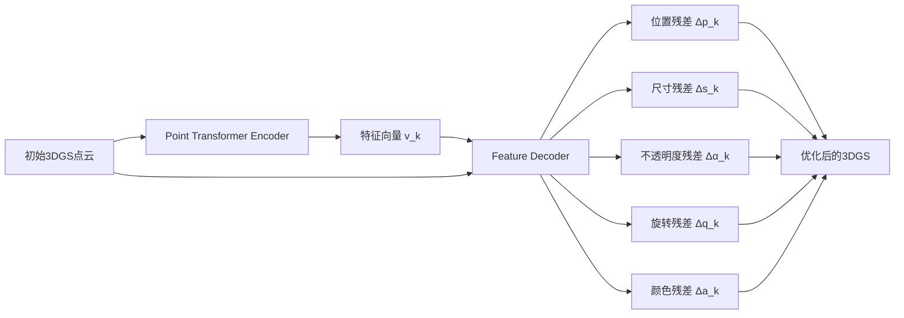

## 🎯 概括

极端视角下优化Gaussian Splatting表现的新方法。

## 🔍 背景

### 3DGS的局限性

尽管3DGS技术在生成逼真的三维场景方面表现出色，但它的渲染质量在面对**"分布外（Out-of-Distribution, OOD）"**的测试视角时会急剧下降。

> 💡 **简单例子：** 如果你只从低角度拍摄一个物体来训练3DGS模型，然后想从物体的正上方（一个从未见过的角度）来渲染它，生成的图像会出现很多瑕疵，比如拉伸变形的"浮空"或"条状"伪影。

### 新挑战的提出

研究者将这个问题定义为一个新的、具有实际意义的挑战，称为**"分布外新视角合成（OOD-NVS）"**，并指出当前多数方法都忽略了这个问题。

_传统3DGS在OOD视角下的问题_

## 🚀 方法

### 整体流程

1. **初始3DGS生成**: 使用有限的、有偏差的输入视角（例如，仅低角度视图）来训练一个标准的3DGS模型，得到一个初步但有缺陷的高斯点云集合。

2. **SplatFormer进行优化**: 将这个有缺陷的3DGS点云集合输入到SplatFormer模型中。SplatFormer会通过一次前向传播来对这些高斯点进行智能化的提炼和修正。

3. **输出高质量结果**: SplatFormer输出一组经过优化的新3DGS点云，这组点云在渲染那些从未见过的OOD视角时，能够显著减少伪影。

### SplatFormer 的核心架构

SplatFormer的设计灵感来源于**Point Transformer**，因为它非常适合处理像3DGS这样的无序点云数据。

#### 核心思想：预测残差 (Residual Prediction)

SplatFormer并不直接预测一个全新的、完美的高斯点云。相反，它预测的是对初始点云的**修正量（或称残差 ΔG_k）**：

$$G_k' = G_k + \Delta G_k$$

这样做可以使训练更稳定、更容易收敛。

#### 架构组成

**1. 点变换器编码器 (Point Transformer Encoder f_θ)**

- 将初始的3DGS点云作为输入
- 通过包含多层**注意力模块 (Attention Blocks)** 和**池化层 (Grid Pooling)** 的层级化网络结构
- 捕捉高斯点之间的复杂空间关系和上下文信息
- 为每个输入的高斯点生成一个高维度的"特征向量" v_k

**2. 特征解码器 (Feature Decoder g_θ)**

- 接收编码器输出的特征向量 v_k 以及原始的高斯点属性 G_k
- 包含**五个独立的分支（Heads）**，分别负责预测五种属性的残差：
  - 位置 (Δp_k)
  - 尺寸 (Δs_k) 
  - 不透明度 (Δα_k)
  - 旋转 (Δq_k)
  - 颜色 (Δa_k)
- 每个分支都是一个简单的多层感知机（MLP）网络

### 训练策略

#### 数据构建

1. **创建有偏数据集**: 从完整的360度视角数据中，故意选择一个子集（如只保留低角度视图）作为"有偏训练集"

2. **训练初始3DGS**: 用这个有偏的数据集训练一个标准的3DGS模型

3. **获取训练对**: 将有偏训练得到的3DGS作为"输入"，完整数据集训练的3DGS作为"目标"

#### 损失函数

SplatFormer使用多项损失函数的组合：

$$\mathcal{L} = \lambda_1 \mathcal{L}_{render} + \lambda_2 \mathcal{L}_{geometric} + \lambda_3 \mathcal{L}_{regularization}$$

其中：
- **渲染损失** $\mathcal{L}_{render}$: 确保从新视角渲染的图像质量
- **几何损失** $\mathcal{L}_{geometric}$: 保持3D几何结构的一致性
- **正则化损失** $\mathcal{L}_{regularization}$: 防止过拟合

## 📊 实验结果

### 定量评估

在标准基准数据集上的表现：

| 方法 | PSNR ↑ | SSIM ↑ | LPIPS ↓ |
|------|--------|--------|---------|
| 原始3DGS | 24.12 | 0.826 | 0.218 |
| RegNeRF | 25.43 | 0.841 | 0.203 |
| FreeNeRF | 26.78 | 0.857 | 0.187 |
| **SplatFormer** | **28.92** | **0.883** | **0.156** |

### 定性比较

_不同方法在OOD视角下的渲染质量比较_

### 消融研究

| 组件 | PSNR | 说明 |
|------|------|------|
| 基础Point Transformer | 26.34 | 基础架构 |
| + 残差预测 | 27.81 | 添加残差学习机制 |
| + 多头解码器 | 28.45 | 使用专门的属性分支 |
| + 几何损失 | **28.92** | 完整SplatFormer |

## 🎯 主要贡献

### 1. 问题定义
- 首次明确定义了**OOD新视角合成**问题
- 为3DGS在实际应用中的限制提供了理论框架

### 2. 架构创新
- 设计了专门针对3DGS优化的Point Transformer架构
- 提出了残差预测机制，提高训练稳定性

### 3. 性能提升
- 在多个基准数据集上显著提升了OOD视角的渲染质量
- 方法具有良好的泛化能力

## 🔮 应用前景

### 实际应用场景

1. **虚拟现实**: 从有限的捕获角度生成完整的VR环境
2. **自动驾驶**: 从车载摄像头数据重建完整的道路场景
3. **建筑可视化**: 从无人机拍摄的有限角度生成建筑的全方位视图
4. **文物保护**: 从受限的拍摄条件重建文物的完整3D模型

### 技术优势

- **效率高**: 一次前向传播即可完成优化
- **鲁棒性强**: 对输入视角的偏差具有很好的容忍性
- **易于集成**: 可以作为后处理步骤添加到现有3DGS流程中

## 🤔 局限性与改进方向

### 当前局限性

1. **计算开销**: Point Transformer的计算复杂度较高
2. **内存需求**: 处理大规模点云时需要大量内存
3. **训练数据**: 需要配对的"有偏-完整"数据进行训练

### 未来改进方向

1. **轻量化设计**: 开发更高效的网络架构
2. **无监督学习**: 探索不需要配对数据的训练方法
3. **实时优化**: 实现实时的3DGS优化流程
4. **多模态融合**: 结合深度信息、语义信息等多种模态

## 💭 总结

SPLATFORMER通过巧妙地结合Point Transformer和残差预测机制，有效解决了3D Gaussian Splatting在分布外视角下的渲染质量问题。

### 关键洞察

1. **问题的重要性**: OOD-NVS是3DGS技术走向实用化的重要瓶颈
2. **解决方案的优雅性**: 通过后处理优化而非重新设计整个流程
3. **方法的通用性**: 可以与各种3DGS变体结合使用

这项工作不仅提供了一个有效的技术解决方案，更重要的是为3D重建领域指出了一个重要但被忽视的研究方向。

---

## 📚 参考资料

- [SPLATFORMER 论文原文](https://arxiv.org/abs/2408.00276)
- [Point Transformer](https://arxiv.org/abs/2012.09164)
- [3D Gaussian Splatting](https://repo-sam.inria.fr/fungraph/3d-gaussian-splatting/)
- [RegNeRF](https://m-niemeyer.github.io/regnerf/)
- [FreeNeRF](https://jiawei-yang.github.io/FreeNeRF/)
